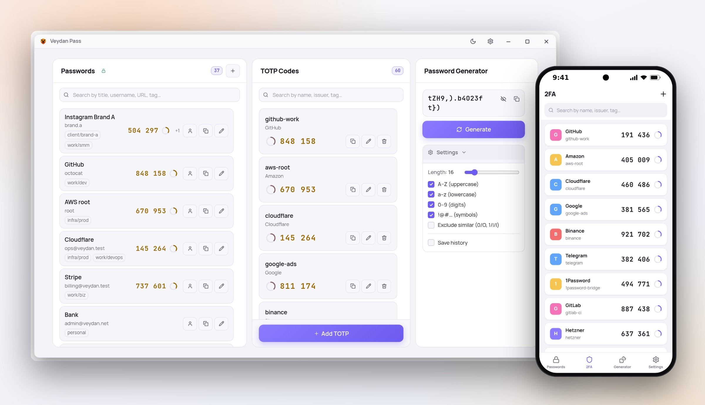
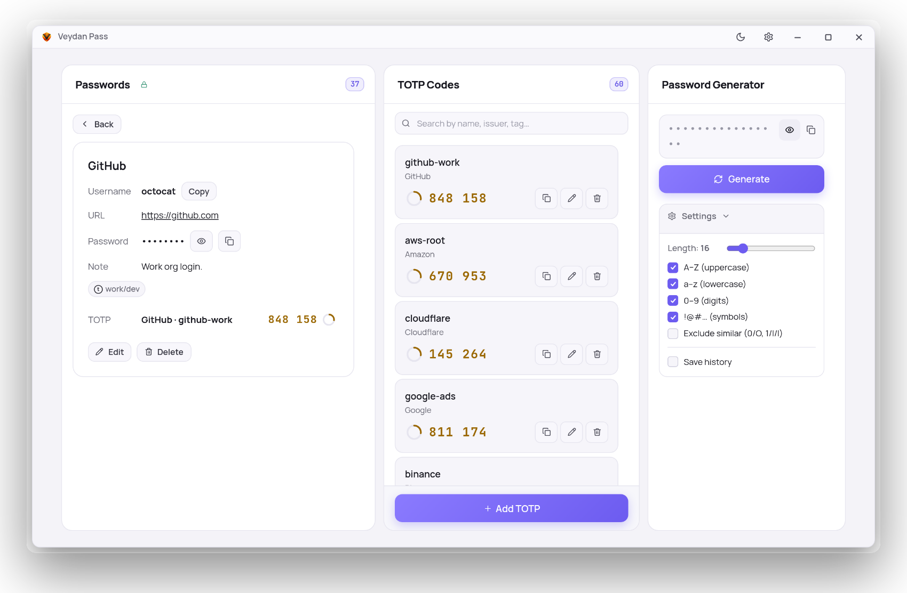
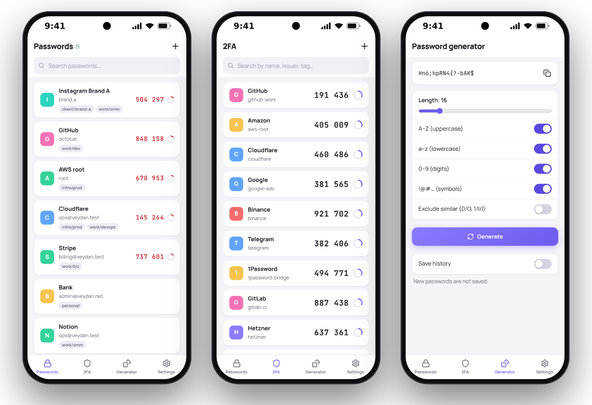

  

<h1 align="center">Veydan Pass</h1>

  <b>Your passwords. Your 2FA. Your vault.</b> 
  A local-first password manager and authenticator with encrypted sync through storage you control.

  
  
  

  15 languages: English · Deutsch · Español · Français · Italiano · Polski · Русский · Українська · Português (Brasil) · Türkçe · Bahasa Indonesia · Tiếng Việt · 简体中文 · 日本語 · 한국어

  <a href="https://github.com/veydanproject/Veydan-Pass/releases/latest"><b>Download</b></a> ·
  <a href="#features">Features</a> ·
  <a href="#on-your-phone">On your phone</a> ·
  <a href="#security">Security</a> ·
  <a href="docs/DEVELOPMENT.md">Build from source</a>

<picture>
  <source media="(prefers-color-scheme: dark)" srcset="docs/images/hero-dark.jpg">
  
</picture>

## Why Veydan Pass

- **Passwords and 2FA side by side.** The login, the password and its
  one-time code are on one card — copy each with a click.
- **Your vault, your storage.** No Veydan cloud and no account. Sync goes
  through a folder, an S3 bucket or a WebDAV share you control, encrypted on
  the device before it leaves.
- **Computer and phone.** Windows, macOS, Linux and Android; scan a 2FA QR
  code with the phone's camera.
- **Small and fast.** A native app that opens in a moment and stays out of
  your way.

## Features

### Passwords

- Entries with title, username, URL, password, a note and tags.
- **Search** by title, username, URL or tag.
- **One click** copies the username, the password or the current code.
- Passwords are hidden until you choose to show them.
- Link one or more **2FA codes** to an entry, and pick the one shown in the
  list.

<picture>
  <source media="(prefers-color-scheme: dark)" srcset="docs/images/screen-card-dark.png">
  
</picture>

### One-time codes (2FA / TOTP)

- Live codes with a countdown, copied with one click.
- Add a code by **pasting an `otpauth://` link**, typing the secret, or
  **uploading a screenshot with the QR code**; on a phone, **scan the QR code
  with the camera**.
- SHA-1, SHA-256 and SHA-512; 6 or 8 digits; 30- or 60-second periods.
- Codes are generated by the app's core; the secret is never shown in full
  once saved.

### Password generator

Length, upper- and lowercase letters, digits, symbols, and "exclude look-alike
characters" (0/O, 1/l/I). An optional history keeps the last passwords you
generated (it is off by default). The generator is also in the tray menu and
the command palette.

## On your phone

The Android app has your passwords, 2FA codes and the generator, synced with
your computer.

<picture>
  <source media="(prefers-color-scheme: dark)" srcset="docs/images/phones-dark.png">
  
</picture>

## Sync between your devices

Settings → Sync. Create a vault in an empty place you control, then join it
from your other devices with the same passphrase:

- **a folder** that Dropbox, Seafile, Syncthing or any cloud client mirrors
  (on a computer);
- **an S3-compatible bucket** (AWS S3, MinIO, Cloudflare R2…);
- **a WebDAV share** (Nextcloud and others).

Sync is in **beta**.

## Download

Get the latest version from the
**[releases page](https://github.com/veydanproject/Veydan-Pass/releases/latest)**.

| Platform | What to download |
|---|---|
| **Windows** 10 and 11 (x64) | the `.exe` installer (or the `.msi`) |
| **macOS** — Apple Silicon | the `.dmg` marked `aarch64` |
| **macOS** — Intel | the `.dmg` marked `x64` |
| **Linux** (x64) | `.AppImage`, or `.deb` / `.rpm` for your distribution |
| **Android** 8.0 and newer (64-bit ARM) | the `.apk` |

If macOS refuses to open the app on the first launch, right-click it and
choose **Open**.

The app updates itself when a new version comes out. Installed from a
`.deb` or `.rpm`? The app tells you about the new version, and you install it
from the releases page.

## Security

Here is exactly what protects what.

- **Passwords and notes of entries are encrypted at rest** with the vault key
  (XChaCha20-Poly1305; the key is derived from your PIN or password by
  Argon2id) and are decrypted only while the app is unlocked.
- **Sync storage only ever sees ciphertext** — everything is encrypted on the
  device before it reaches your folder, bucket or WebDAV share.
- **Not encrypted at rest on the device:** titles, usernames and URLs of
  entries, the secrets of 2FA codes, and the generator history if you turn
  it on. They are in the app's local database; protect the disk with
  full-disk encryption.
- **App lock** — a PIN or password, auto-lock after inactivity, and a
  one-time **recovery key** that lets you set a new PIN without losing data.
- **No account, no telemetry.** The app talks only to your own sync storage
  and to GitHub, to check for updates.

## The Veydan family

| | App | What it is |
|---|---|---|
|  | **Veydan Pass** | Passwords and one-time codes, encrypted and synced |
|  | [Veydan Notes](https://github.com/veydanproject/Veydan-Notes) | Markdown notes with end-to-end encrypted sync |
|  | [Veydan Chat](https://github.com/veydanproject/Veydan-Chat) | End-to-end encrypted chat on Nostr |
|  | [Veydan Space](https://github.com/veydanproject/Veydan-Space) | All of them in one workspace, plus browser profiles, proxies and SSH |

## Feedback

Found a bug or have an idea? [Open an issue](https://github.com/veydanproject/Veydan-Pass/issues).
Developers: see [docs/DEVELOPMENT.md](docs/DEVELOPMENT.md) for building from
source.

## License

Copyright © 2026 **Veydan Project**.

Developed by **Rookbeam Technologies LLC**, USA.

Veydan Pass is **source-available** software under the
[PolyForm Perimeter License 1.0.1](https://polyformproject.org/licenses/perimeter/1.0.1):
see [`LICENSE`](LICENSE), a summary in [`LICENSE-SUMMARY.md`](LICENSE-SUMMARY.md)
and the licences of what it is built from in
[`THIRD-PARTY-LICENSES.md`](THIRD-PARTY-LICENSES.md).
